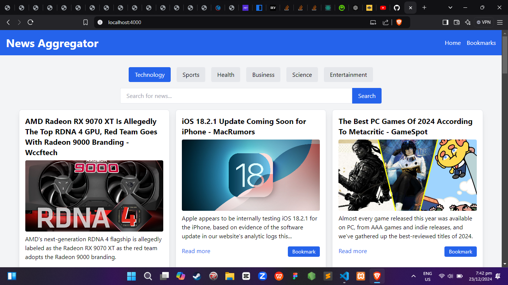

----- NEWS AGGREGATOR WEB APP -----

## Usage
   1. Create a folder & Download the repository

      $ git clone https://github.com/Tatakai7/News-Aggregator-Web-App.git
      $ cd News-Aggregator-Web-App

 FIRST STEP IS YOU NEED TO CREATE AN NEWSAPI ACCOUNT ON [newsapi.org](newsapi.org)
 THEN YOU NEED TO CREATE A .env file AND PUT YOUR API KEY
 
## Available Scripts

In the project directory, you can run:

### `npm start`

Runs the app in the development mode.\
Open [http://localhost:3000](http://localhost:3000) to view it in your browser.
